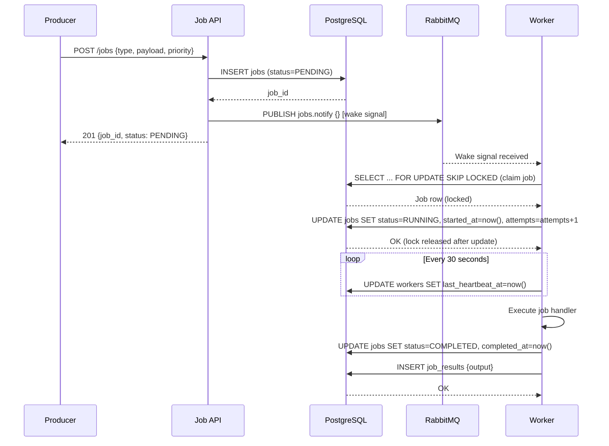
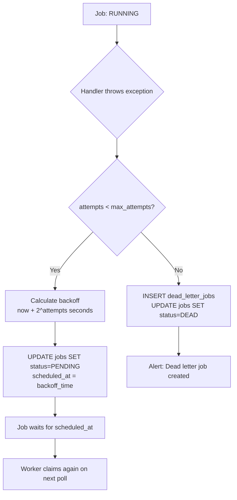
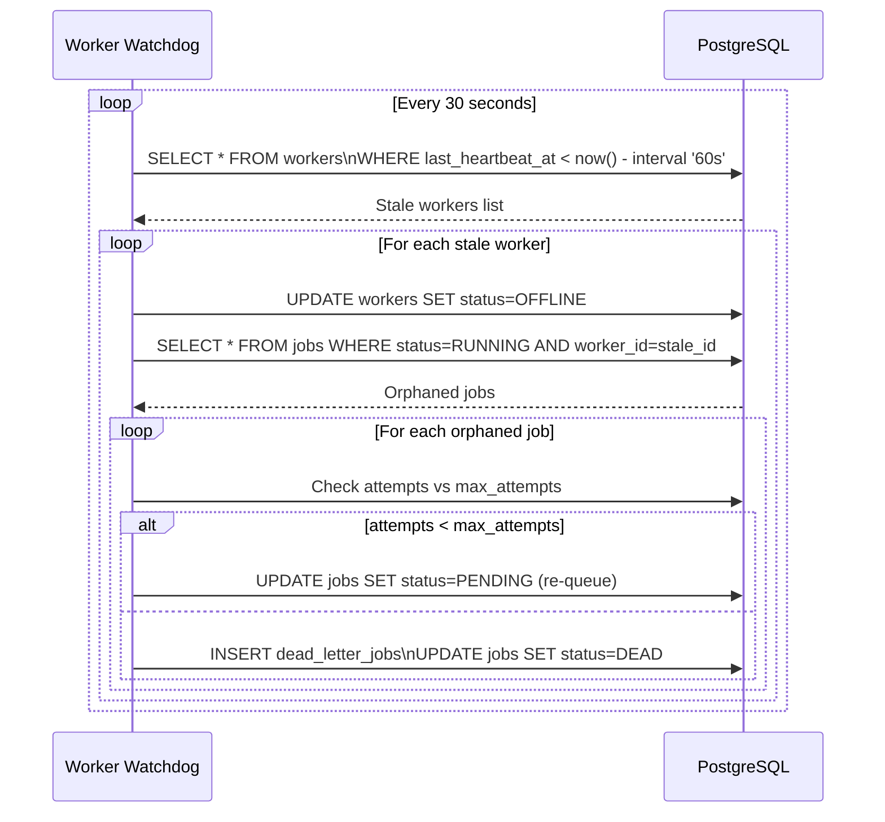

# Requirements — Distributed Job Queue

---

## Functional Requirements

**FR-01** — The system shall allow any producer service to submit a background job by
providing a job type, JSON payload, optional priority, and optional scheduled execution time.

**FR-02** — The system shall return a job ID immediately upon submission, before the job
has been processed.

**FR-03** — The system shall allow workers to claim available jobs atomically — no two
workers may claim the same job simultaneously.

**FR-04** — The system shall support job priorities: HIGH, NORMAL, and LOW. Higher priority
jobs shall be claimed before lower priority jobs of equal age.

**FR-05** — The system shall support delayed job execution: jobs submitted with a
`scheduled_at` time in the future shall not be available for claiming until that time arrives.

**FR-06** — The system shall retry a failed job with exponential backoff, up to a
configurable maximum number of attempts (default: 5).

**FR-07** — The system shall move a job to the dead letter queue after it has exceeded
its maximum retry attempts, recording the failure reason.

**FR-08** — The system shall detect worker failures via heartbeat timeout. A worker that
has not sent a heartbeat within 60 seconds is considered dead, and its in-progress job
is reclaimed for retry.

**FR-09** — The API must return the current status, attempt count, and result (if completed)
for any job by ID.

**FR-10** — The system shall allow cancellation of any job in PENDING status. Running jobs
may not be cancelled via the API.

**FR-11** — The system shall expose queue metrics via the API: current queue depth by
priority and status, active worker count, and dead letter job count.

**FR-12** — The system shall store the output (result or error message) of every completed
or permanently failed job for post-execution inspection.

---

## Non-Functional Requirements

### Availability

- **NFR-01** — The Job Submission API shall maintain 99.9% uptime.
- **NFR-02** — Worker pool availability is a function of instance count. At least one worker
  instance must be running at all times. Worker scaling is operator-managed.

### Latency

- **NFR-03** — Job start delay (time from submission to start of execution by a worker) p95
  ≤ 5,000ms under normal load.
- **NFR-04** — `GET /jobs/{id}` status API p99 ≤ 100ms.
- **NFR-05** — Job submission (`POST /jobs`) p99 ≤ 200ms.

### Throughput

- **NFR-06** — The system shall process 1,000,000 jobs per day at normal load.
- **NFR-07** — The system shall support 100 concurrent worker instances without contention
  on job claiming.

### Durability

- **NFR-08** — Zero tolerance for job loss. Every job that receives a successful creation
  response must either be eventually processed to completion or moved to the dead letter
  queue. Silent job drops are not acceptable.

### Consistency

- **NFR-09** — Job status reads are strongly consistent — a status query immediately after
  a state change reflects the new state.
- **NFR-10** — At most one worker processes a given job at any point in time. Duplicate
  execution of a single job attempt is not permitted.

### Idempotency

- **NFR-11** — Job handlers are expected to be idempotent at the application level. The
  queue guarantees at-least-once execution (a worker crash may cause re-execution from
  the beginning). Exactly-once processing is the responsibility of the job handler.

---

## Estimated Traffic.

| Metric                               | Estimate                       |
| ------------------------------------ | ------------------------------ |
| Jobs submitted per day               | 1,000,000                      |
| Average jobs per second              | ~12                            |
| Peak burst rate                      | ~100 jobs/second               |
| Concurrent worker instances          | 100                            |
| Heartbeat writes per second          | ~3 (100 workers × 1/30s)       |
| Job result rows stored per day       | 1,000,000                      |
| Average job execution time           | 5–30 seconds (job type varies) |
| Dead letter jobs per day (est. 0.1%) | ~1,000                         |

---

## Data Flow.

### Job Lifecycle — Happy Path

### Job Failure and Retry Flow

### Worker Watchdog — Orphan Recovery

